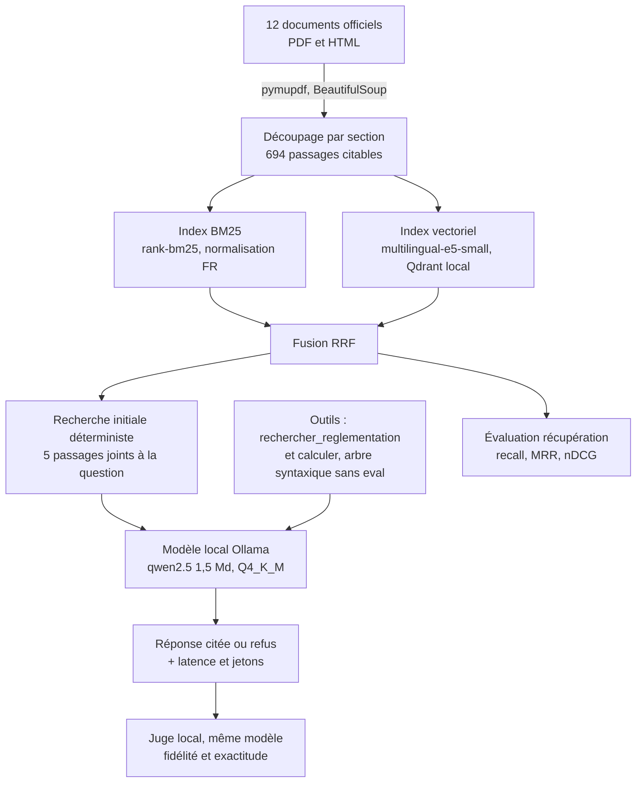
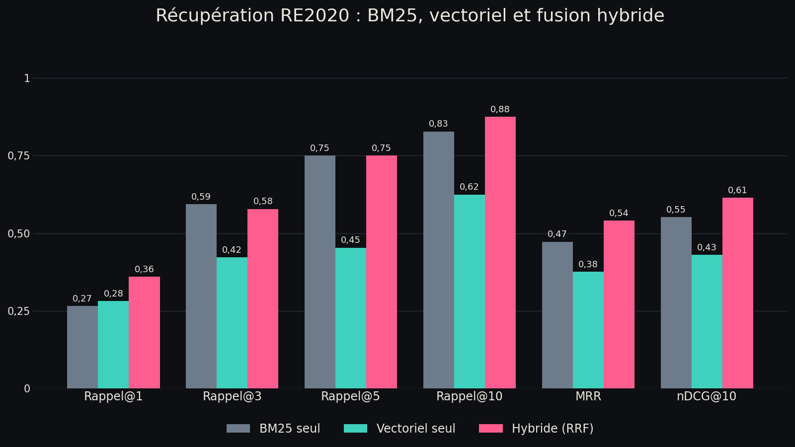

# Assistant RE2020 : RAG hybride et agent outillé, 100 % local

Assistant de questions-réponses sur la réglementation environnementale RE2020, construit sur les textes
officiels publiés par l'État. Recherche hybride (BM25 et embeddings), génération par un modèle ouvert
exécuté en local avec Ollama, réponses citées, refus quand les sources ne couvrent pas la question, et un
jeu d'évaluation de 37 questions avec réponses de référence vérifiées dans les textes.

Aucune clé API, aucun appel sortant, coût d'exécution nul. La contrepartie, mesurée et publiée telle
quelle, est la latence et la qualité d'un petit modèle contraint par 8 Go de RAM.

## Problème

Les règles RE2020 sont éclatées entre le code de la construction et de l'habitation, l'arrêté du
4 août 2021 et ses onze annexes, et un guide ministériel de 93 pages. Une question simple comme
« quel seuil carbone pour une maison en 2025 ? » demande de retrouver le bon tableau, la bonne année de
dépôt du permis et le bon usage de bâtiment. Les assistants généralistes répondent de mémoire, sans
source et sans distinguer les versions successives des textes : sur un sujet réglementaire, c'est
inutilisable.

L'objectif est un assistant qui ne répond qu'à partir de passages retrouvés dans les textes, cite
toujours le document et l'article utilisés, et refuse de répondre quand les sources ne le permettent pas.

## Architecture



## Résultats de récupération

Mesure réelle du 22/09/2026 sur les 32 questions du jeu d'évaluation qui attendent une réponse
(les 5 questions hors périmètre n'ont pas de passage attendu). Chaque question déclare une ou deux
phrases de référence ; un passage compte comme correct s'il contient la phrase attendue.
Source des chiffres : `results/retrieval_metrics.json`.

| Moteur                     | Rappel@1  | Rappel@3  | Rappel@5 | Rappel@10 | MRR       | nDCG@10   | Latence médiane |
| -------------------------- | --------- | --------- | -------- | --------- | --------- | --------- | --------------- |
| BM25 seul                  | 0,266     | **0,594** | 0,750    | 0,828     | 0,472     | 0,552     | 7 ms            |
| Vectoriel seul (e5-small)  | 0,281     | 0,422     | 0,453    | 0,625     | 0,376     | 0,430     | 43 ms           |
| Hybride (RRF, k = 60)      | **0,359** | 0,578     | 0,750    | **0,875** | **0,541** | **0,614** | 63 ms           |



Lecture : sur ce corpus très technique, le lexical domine le vectoriel seul, parce que les questions
reprennent les identifiants réglementaires (Bbio_max, Q4Pa-surf, Icconstruction). La fusion hybride
récupère quand même le meilleur des deux : premier résultat correct dans 36 % des cas contre 27 % pour
BM25, et 88 % des sources attendues présentes dans les dix premiers résultats. L'apport du vectoriel est
mesuré et modeste : sur ce jeu, il ne sauve qu'une question, « quelle part des baies d'un local doit
pouvoir s'ouvrir ? », qu'il place au premier rang alors que BM25 la renvoyait en huitième position ; la
fusion la garde au premier rang. À l'inverse, trois questions ne sont trouvées par aucun des trois
moteurs dans les dix premiers résultats (seuil DH d'une maison individuelle, vérification de la
ventilation, liste des indicateurs attestés) : leurs passages attendus sont des tableaux ou des
paragraphes dont le vocabulaire ne recoupe presque pas celui de la question.

## Génération locale

<!-- RESULTATS_GENERATION -->

## Reproduire

Depuis un clone vierge, avec [uv](https://docs.astral.sh/uv/) et
[Ollama](https://ollama.com/download) installés :

```bash
git clone https://github.com/yzasmin/re2020-assistant-rag.git
cd re2020-assistant-rag
uv sync

ollama pull qwen2.5:1.5b-instruct-q4_K_M   # 986 Mo

uv run python -m re2020 telecharger     # 12 documents officiels dans data/raw (environ 9 Mo)
uv run python -m re2020 indexer         # 694 passages + index vectoriel (environ 10 min sur CPU)
uv run python -m re2020 eval-retrieval  # results/retrieval_metrics.json + le graphique
uv run python -m re2020 eval-generation # results/generation_metrics.json + les traces
uv run pytest                           # 51 tests, aucun appel réseau
```

Recherche seule, sans modèle de langage :

```bash
uv run python -m re2020 chercher "seuil carbone maison individuelle 2025" -k 5
uv run python -m re2020 chercher "perméabilité à l'air" --mode bm25
```

Interroger l'assistant :

```bash
uv run python -m re2020 ask "Quel est le seuil Icconstruction d'une maison individuelle en 2025 ?"
uv run python -m re2020 ask "Quelle perméabilité à l'air pour un logement collectif ?" --json
```

Le nom du modèle est configurable dans `.env` (`OLLAMA_MODEL`), tout comme l'adresse du serveur
(`OLLAMA_HOST`). L'indexation tient dans moins de 500 Mo de mémoire : embeddings ONNX quantifiés int8
calculés par lots de 16, index Qdrant en mode local sur disque (2,8 Mo), aucun service distant.

## Structure

```
src/re2020/
  sources.py        les 12 documents, leurs URL, leurs licences, le téléchargement et le manifeste
  chunking.py       extraction PDF et HTML, découpage par section, métadonnées de citation
  text.py           normalisation française pour BM25 (accents, élisions, mots vides, racinisation)
  retrieval.py      index BM25, index vectoriel Qdrant, fusion RRF
  calculator.py     évaluation arithmétique sûre par arbre syntaxique, sans eval
  ollama_client.py  client HTTP local (chat, modèles chargés, mémoire occupée)
  agent.py          recherche initiale, boucle d'appel d'outils, citations, refus, jetons
  judge.py          juge local (fidélité et exactitude) en sortie contrainte par schéma JSON
  evaluation.py     jeu de questions et métriques recall@k, MRR, nDCG@k
  eval_retrieval.py mesure de la récupération et graphique comparatif
  eval_generation.py mesure de la génération (fidélité, citations, refus, latence, mémoire)
  __main__.py       interface en ligne de commande
eval/questions.jsonl  37 questions avec réponses de référence et phrases attendues
results/              métriques réelles, traces de génération et graphiques
tests/                51 tests, client Ollama simulé pour l'agent et le juge
data/manifest.json    empreintes SHA-256 et date de téléchargement des documents
```

## Données et licence

12 documents officiels, 694 passages, 726 000 caractères, téléchargés le 22/09/2026 (empreintes dans
`data/manifest.json`, fichiers non commités car reconstructibles par script) :

| Document                                                                         | Passages | Source                                   | Licence                                   |
| -------------------------------------------------------------------------------- | -------- | ---------------------------------------- | ----------------------------------------- |
| Arrêté du 4 août 2021, annexe II (règles générales de calcul)                     | 234      | rt-re-batiment.developpement-durable.gouv.fr | Licence Ouverte / Etalab 2.0          |
| Annexe de l'article R. 172-4 du CCH, chapitres I à III (version au 1er juillet 2026) | 179   | rt-re-batiment.developpement-durable.gouv.fr | Licence Ouverte / Etalab 2.0          |
| Guide RE 2020 du ministère (Cerema, janvier 2024)                                 | 150      | ecologie.gouv.fr                         | publication administrative, réutilisation libre |
| Arrêté du 4 août 2021, version consolidée au 19 mars 2026 (articles 1 à 52)       | 81       | aida.ineris.fr                           | texte officiel, réutilisation libre       |
| Annexes I, V à XI de l'arrêté du 4 août 2021                                      | 50       | rt-re-batiment.developpement-durable.gouv.fr | Licence Ouverte / Etalab 2.0          |

Le portail RT-RE bâtiment précise que ses contenus sont sous Licence Ouverte Etalab 2.0, et que les
annexes publiées y sont un outil de documentation sans portée juridique : les textes de référence restent
ceux publiés au Journal officiel (décret n° 2021-1004 du 29 juillet 2021, JORFTEXT000043877196 ; arrêté du
4 août 2021, JORFTEXT000043936431). Légifrance refuse les téléchargements automatisés (HTTP 403) : la
version consolidée de l'arrêté est donc reprise de la base AIDA de l'Ineris, qui reproduit le texte
officiel, et chaque passage cite l'URL Légifrance de référence.

Modèles utilisés : `intfloat/multilingual-e5-small` pour les embeddings (licence MIT, export ONNX
quantifié publié par Xenova) et `qwen2.5:1.5b-instruct-q4_K_M` pour la génération (licence Apache 2.0),
tous deux exécutés en local.

## Limites

<!-- LIMITES_GENERATION -->

- **Rappel@1 de 0,36.** Un tiers seulement des questions trouve la bonne source en premier résultat.
  L'assistant reçoit cinq passages, ce qui porte le rappel à 0,75, mais un reclassement (cross-encoder)
  ou un découpage plus fin des grands tableaux amélioreraient nettement ce chiffre.
- **Les tableaux réglementaires passent mal en texte.** Les seuils vivent dans des tableaux à plusieurs
  entrées (usage, année, zone climatique) que l'extraction PDF aplatit en suite de nombres. Un passage
  peut donc contenir le bon chiffre sans que sa condition d'application soit lisible.
- **Le corpus n'est pas complet.** La méthode de calcul Th-BCE (annexe III) et les règles Th-Bat
  (annexe IV), plusieurs centaines de pages, ne sont pas indexées, ni les FAQ officielles, ni le décret
  lui-même faute d'accès automatisé à Légifrance. Les questions de méthode de calcul détaillée sont donc
  hors d'atteinte.
- **Les textes évoluent vite.** Le corpus mélange une consolidation de mars 2026 et un guide de janvier
  2024, antérieur aux décrets de 2024 et 2026 : sur les points modifiés depuis, le guide peut contredire
  le texte consolidé. Le manifeste fige la date et les empreintes, mais une réindexation régulière est
  nécessaire.
- **Le jeu d'évaluation est modeste** : 37 questions écrites par une seule personne, ce qui suffit à
  comparer des moteurs mais pas à mesurer finement une différence de quelques points.

## Crédits

Projet réalisé par Yasmina Saoud. Textes réglementaires : ministère de la Transition écologique,
Cerema, Ineris (AIDA). Modèles ouverts : `intfloat/multilingual-e5-small` (MIT) et Qwen2.5 (Apache 2.0),
servis par Ollama.
